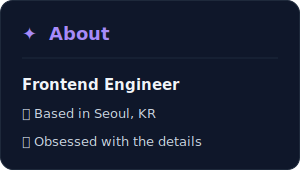

<!-- HEADER ─────────────────────────────────────────────────────── -->

  

<!-- ABOUT × STACK ──────────────────────────────────────────────── -->

  
  &nbsp;
  

<!-- GITHUB ─────────────────────────────────────────────────────── -->

<h3 align="center">&nbsp;✦&nbsp; GitHub</h3>

  
  &nbsp;
  

  

<!-- FOOTER ─────────────────────────────────────────────────────── -->

  

